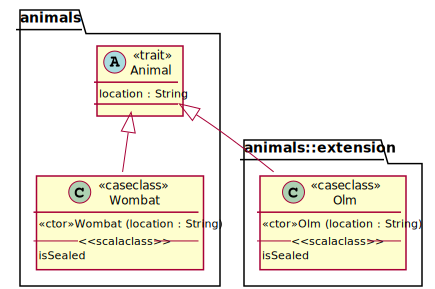

# scala-uml

Compiler-independent framework to obtain UML class diagrams from Scala 2 or Scala 3 source code.

**Input:** Folder of Scala files or a config referencing directories in a public Github repository. 

**Output:**  Image of a class diagram in the svg format, or a file in the UML class diagram format of the [PlantUML](https://plantuml.com/de/class-diagram) project.

<table>
<tr>
<th>
animal.scala
</th>
<th>
olm.scala
</th>
</tr>
<tr>
<td>

```Scala
trait Animal {
  val location : String
}

sealed case class Wombat(
                          location:String
                        ) extends Animal
```

</td>
<td>
<pre>

```Scala
package animals.extension

import animals.Animal

sealed case class Olm(
                       location:String
                     ) extends Animal
```

</td>
</tr>
</table>


